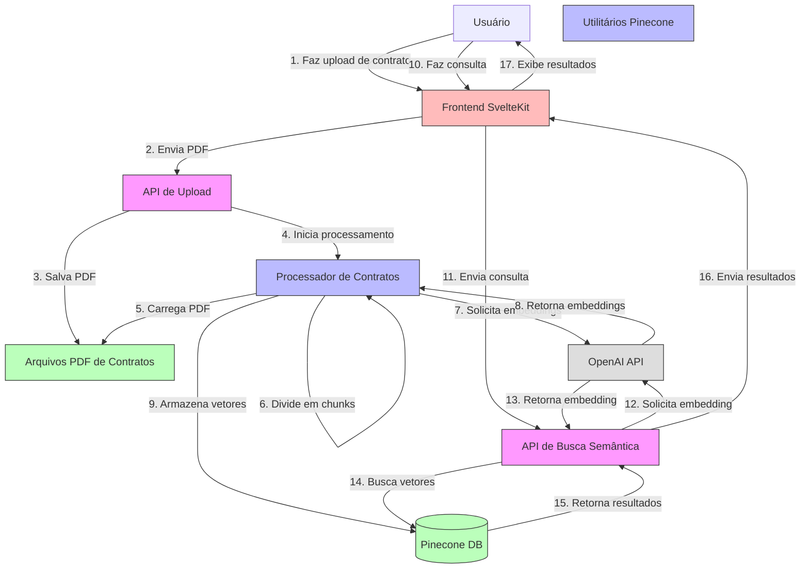

# Diagrama de Arquitetura - Contratus AI Imobiliária

## Arquivos do Sistema

| Componente | Arquivo | Descrição |
|-----------|---------|------------|
| API de Upload | `api_upload.py` | Recebe e processa uploads de contratos |
| API de Busca | `api_pinecone.py` | Realiza buscas semânticas nos contratos |
| Processador | `processar_contrato.py` | Extrai texto, divide em chunks e gera embeddings |
| Utilitários | `pinecone_utils.py` | Funções auxiliares para interação com Pinecone |

## Fluxo de Processamento de Contratos

1. O usuário faz upload de um contrato PDF através do frontend SvelteKit
2. A API de Upload recebe o arquivo e o salva na pasta de contratos
3. O Processador de Contratos é acionado em segundo plano para:
   - Carregar o PDF e extrair o texto
   - Dividir o texto em chunks menores
   - Gerar embeddings para cada chunk usando a OpenAI
   - Armazenar os vetores e metadados no Pinecone

## Fluxo de Consulta Semântica

1. O usuário faz uma consulta em linguagem natural através do frontend
2. A API de Busca Semântica recebe a consulta e:
   - Gera um embedding para a consulta usando a OpenAI
   - Busca os vetores mais similares no Pinecone
   - Retorna os resultados ordenados por relevância
3. O frontend exibe os resultados ao usuário
