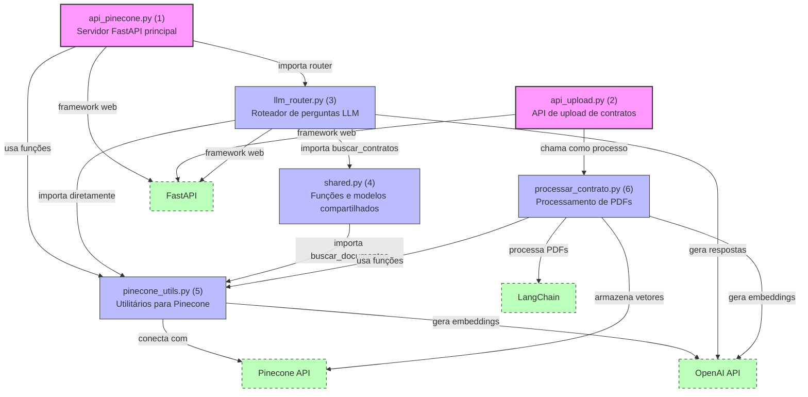

# Diagrama de Relações entre Módulos do Backend

## Descrição das Relações entre Módulos

### Módulos Principais

1. **api_pinecone.py**
   - Servidor FastAPI principal que gerencia as rotas da API
   - Inclui o roteador LLM para perguntas em linguagem natural
   - Implementa endpoints para busca semântica e listagem de contratos
   - Gerencia a conexão com o Pinecone

2. **llm_router.py**
   - Implementa o endpoint `/llm/ask` para perguntas em linguagem natural
   - Usa diretamente `buscar_documentos` de `pinecone_utils.py` para busca semântica
   - Formata o contexto e gera respostas usando a API OpenAI

3. **shared.py**
   - Contém modelos de dados e funções compartilhadas
   - Implementa `buscar_contratos` que usa `buscar_documentos` de `pinecone_utils.py`
   - Define exceções e modelos Pydantic usados em toda a aplicação

4. **pinecone_utils.py**
   - Fornece funções para interagir com o Pinecone
   - Implementa `buscar_documentos` para busca semântica
   - Gerencia a geração de embeddings usando a API OpenAI

5. **processar_contrato.py**
   - Processa arquivos PDF de contratos
   - Divide o texto em chunks usando LangChain
   - Gera embeddings e armazena no Pinecone

6. **api_upload.py**
   - Gerencia o upload de novos contratos
   - Chama `processar_contrato.py` como processo em segundo plano

### Fluxo de Dados

1. O usuário faz uma pergunta através do frontend ou API
2. `llm_router.py` recebe a pergunta e chama `buscar_documentos` de `pinecone_utils.py`
3. `pinecone_utils.py` gera embeddings da pergunta e consulta o Pinecone
4. `llm_router.py` formata os resultados e gera uma resposta usando OpenAI
5. A resposta é retornada ao usuário

### Processamento de Novos Contratos

1. O usuário faz upload de um contrato através do frontend
2. `api_upload.py` recebe o arquivo e o salva temporariamente
3. `processar_contrato.py` é chamado para processar o PDF
4. O texto é dividido em chunks, embeddings são gerados e armazenados no Pinecone
5. Os novos vetores ficam disponíveis para consulta
