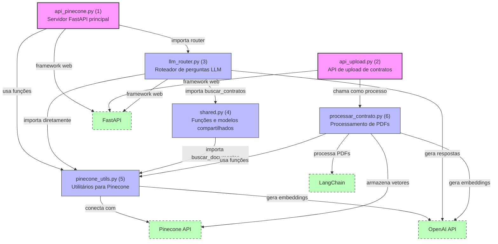
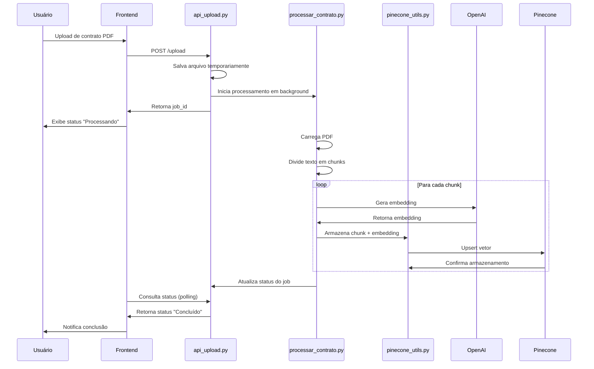
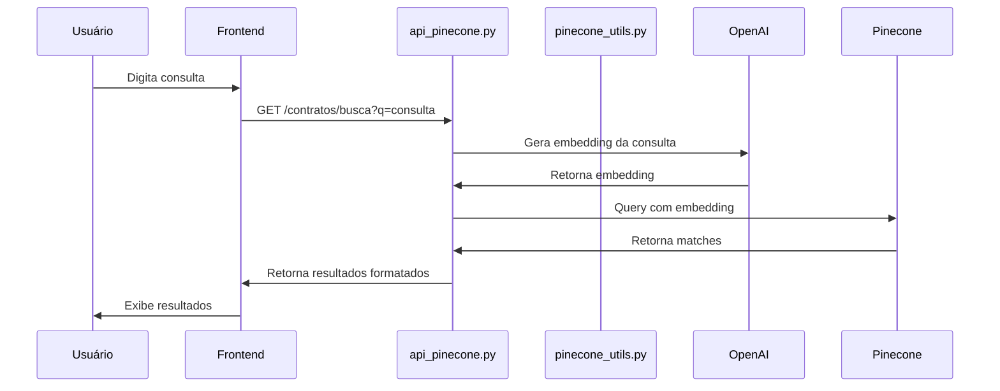
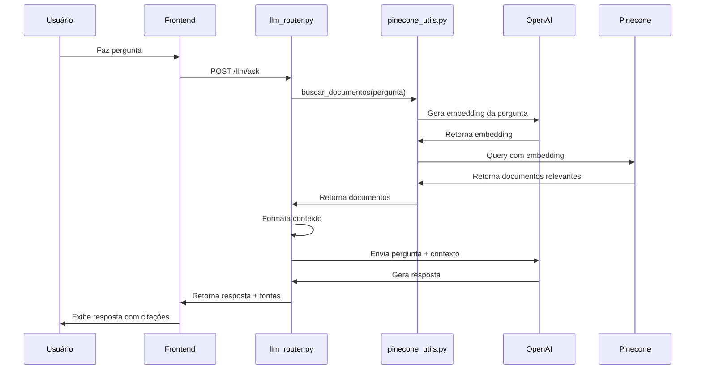

# Contratus AI - Documentação Técnica e de Negócios


**Versão:** 2.0.0  
**Data:** 29 de Abril de 2025  
**Autor:** Equipe Contratus AI

---

## Sumário

1. [Visão Geral do Produto](#1-visão-geral-do-produto)
2. [Arquitetura do Sistema](#2-arquitetura-do-sistema)
3. [Componentes do Backend](#3-componentes-do-backend)
4. [Componentes do Frontend](#4-componentes-do-frontend)
5. [Fluxos de Dados](#5-fluxos-de-dados)
6. [Tecnologias Utilizadas](#6-tecnologias-utilizadas)
7. [Requisitos de Sistema](#7-requisitos-de-sistema)
8. [Instalação e Configuração](#8-instalação-e-configuração)
9. [Guia de Uso](#9-guia-de-uso)
10. [Segurança e Privacidade](#10-segurança-e-privacidade)
11. [Manutenção e Suporte](#11-manutenção-e-suporte)
12. [Roadmap de Evolução](#12-roadmap-de-evolução)
13. [Glossário](#13-glossário)
14. [FAQ](#14-faq)

---

## 1. Visão Geral do Produto

### 1.1 Descrição

O Contratus AI é um sistema avançado de gestão e consulta de contratos imobiliários que utiliza inteligência artificial e processamento de linguagem natural para permitir buscas semânticas e perguntas em linguagem natural sobre documentos contratuais. O sistema foi projetado para revolucionar a forma como empresas imobiliárias gerenciam, acessam e extraem informações de seus contratos.

### 1.2 Proposta de Valor

- **Acesso Instantâneo a Informações:** Encontre cláusulas, valores, datas e outras informações em segundos, sem precisar ler documentos inteiros.
- **Consultas em Linguagem Natural:** Faça perguntas como "Qual o valor do aluguel que Eduardo paga?" ou "Temos informações de boleto no contrato?" e obtenha respostas precisas.
- **Centralização de Documentos:** Mantenha todos os contratos em um único repositório digital, facilmente acessível e pesquisável.
- **Economia de Tempo:** Reduza drasticamente o tempo gasto na busca e análise de informações contratuais.
- **Redução de Erros:** Minimize erros humanos na interpretação de cláusulas contratuais.

### 1.3 Público-Alvo

- Imobiliárias e administradoras de imóveis
- Departamentos jurídicos de empresas do setor imobiliário
- Corretores de imóveis
- Gestores de contratos imobiliários

### 1.4 Casos de Uso Principais

1. **Busca Semântica de Contratos:** Encontrar contratos relevantes com base em consultas contextuais.
2. **Perguntas sobre Contratos:** Obter respostas específicas sobre cláusulas, valores, datas e partes envolvidas.
3. **Processamento de Novos Contratos:** Digitalizar e vetorizar novos documentos para consulta futura.
4. **Análise de Portfólio:** Visualizar e analisar todos os contratos disponíveis no sistema.

---

## 2. Arquitetura do Sistema

### 2.1 Visão Geral da Arquitetura

O Contratus AI Imobiliária segue uma arquitetura moderna de microserviços, dividida em duas partes principais:

1. **Backend:** Desenvolvido em Python com FastAPI, responsável pelo processamento de documentos, geração de embeddings, busca semântica e integração com modelos de linguagem.
2. **Frontend:** Desenvolvido com SvelteKit, oferece uma interface intuitiva e responsiva para interação com o sistema.

O sistema utiliza bancos de dados vetoriais (Pinecone) para armazenar e consultar representações semânticas dos documentos, além de APIs de inteligência artificial (OpenAI) para processamento de linguagem natural.

### 2.2 Diagrama de Arquitetura



**Legenda:**
- **Rosa:** APIs principais (pontos de entrada)
- **Azul:** Módulos utilitários e internos
- **Verde:** Dependências externas

### 2.3 Fluxos de Dados Principais

1. **Processamento de Contratos:**
   - Upload do documento → Processamento do PDF → Divisão em chunks → Geração de embeddings → Armazenamento no Pinecone

2. **Busca Semântica:**
   - Consulta do usuário → Geração de embedding da consulta → Busca vetorial no Pinecone → Retorno dos resultados relevantes

3. **Perguntas em Linguagem Natural:**
   - Pergunta do usuário → Busca semântica de documentos relevantes → Formatação do contexto → Geração de resposta pelo LLM → Retorno ao usuário


## 3. Componentes do Backend

### 3.1 Módulos Principais

#### 3.1.1 api_pinecone.py

Este é o módulo principal do servidor FastAPI, responsável por:

- Inicializar a aplicação FastAPI
- Gerenciar a conexão com o Pinecone
- Definir os endpoints de API para busca semântica e listagem de contratos
- Incluir o roteador LLM para perguntas em linguagem natural

**Endpoints Principais:**
- `GET /`: Verifica o status do sistema
- `GET /contratos`: Lista todos os contratos disponíveis com paginação
- `GET /contratos/busca`: Realiza busca semântica nos contratos
- `GET /contratos/arquivos`: Lista todos os nomes de arquivos únicos no índice

**Funcionalidades Chave:**
- Conexão com retry automático ao Pinecone
- Geração de embeddings para consultas
- Tratamento de erros e reconexão automática

#### 3.1.2 api_upload.py

Módulo responsável pelo upload e processamento de novos contratos:

- Recebe arquivos PDF via endpoint HTTP
- Salva temporariamente os arquivos
- Inicia o processamento em segundo plano
- Retorna status do processamento

**Endpoints Principais:**
- `POST /upload`: Recebe e processa um novo contrato
- `GET /upload/status/{job_id}`: Verifica o status de um processamento

**Segurança:**
- Validação de tipos de arquivo (apenas PDF)
- Limite de tamanho de arquivo
- Sanitização de nomes de arquivo

#### 3.1.3 llm_router.py

Módulo que implementa o roteador para perguntas em linguagem natural:

- Define o endpoint `/llm/ask`
- Busca documentos relevantes usando `buscar_documentos` de `pinecone_utils.py`
- Formata o contexto para o LLM
- Gera respostas usando a API OpenAI
- Retorna a resposta e as fontes utilizadas

**Melhorias Recentes:**
- Contorno da função `buscar_contratos` para acessar diretamente `buscar_documentos`
- Tratamento de erros mais robusto
- Instruções mais detalhadas para o LLM gerar respostas estruturadas

#### 3.1.4 shared.py

Módulo com funções e modelos compartilhados:

- Define modelos Pydantic para estruturas de dados
- Implementa a função `buscar_contratos` que usa `buscar_documentos`
- Fornece funções utilitárias usadas por outros módulos

#### 3.1.5 pinecone_utils.py

Módulo com utilitários para interação com o Pinecone:

- Implementa `buscar_documentos` para busca semântica
- Gerencia a geração de embeddings
- Fornece funções para interagir com o índice Pinecone

**Funcionalidades Chave:**
- Validação de consultas
- Tratamento de erros de conexão
- Formatação consistente dos resultados

#### 3.1.6 processar_contrato.py

Módulo para processamento de arquivos PDF:

- Carrega e processa documentos PDF
- Divide o texto em chunks usando LangChain
- Gera embeddings para cada chunk
- Armazena os vetores no Pinecone

**Algoritmo de Processamento:**
1. Carrega o PDF com PyPDFLoader
2. Extrai o texto completo
3. Divide em chunks de tamanho apropriado
4. Gera embeddings para cada chunk
5. Armazena no Pinecone com metadados

### 3.2 Estruturas de Dados

#### 3.2.1 Modelos Pydantic

```python
# Modelo base para contratos
class ContratoBase(BaseModel):
    arquivo: str
    texto: str

# Modelo para resposta de contrato com score
class ContratoResponse(ContratoBase):
    score: float = 0.0
    
# Modelo para resposta de busca
class SearchResponse(BaseModel):
    resultados: List[ContratoResponse]
    total: int

# Modelo para requisição de pergunta
class QuestionRequest(BaseModel):
    question: str
    max_results: int = 3

# Modelo para resposta de pergunta
class QuestionResponse(BaseModel):
    answer: str
    sources: List[Dict[str, str]]
```

#### 3.2.2 Formato de Documentos no Pinecone

Cada documento armazenado no Pinecone contém:

- **Vetor:** Embedding gerado pelo modelo OpenAI
- **Metadados:**
  - `arquivo`: Nome do arquivo original
  - `texto`: Texto do chunk
  - `page`: Número da página (opcional)
  - `chunk_id`: Identificador único do chunk

### 3.3 Integração com APIs Externas

#### 3.3.1 OpenAI

- **Modelos Utilizados:**
  - `text-embedding-3-small`: Para geração de embeddings
  - `gpt-4o-mini` (padrão): Para geração de respostas

- **Configuração:**
  - Temperatura: 0.3 (para respostas mais determinísticas)
  - Instruções específicas para respostas detalhadas e estruturadas

#### 3.3.2 Pinecone

- **Configuração:**
  - Índice: Definido por `PINECONE_INDEX_NAME` (padrão: "brito-ai")
  - Host: Definido por `PINECONE_HOST`
  - Dimensão: 1536 (compatível com `text-embedding-3-small`)

- **Operações:**
  - Upsert: Para adicionar novos vetores
  - Query: Para busca semântica
  - Describe Index Stats: Para estatísticas do índice

#### 3.3.3 LangChain

- **Componentes Utilizados:**
  - PyPDFLoader: Para carregar documentos PDF
  - RecursiveCharacterTextSplitter: Para dividir textos em chunks

## 4. Componentes do Frontend

### 4.1 Estrutura do Frontend

O frontend é desenvolvido com SvelteKit e organizado da seguinte forma:

```
frontend/
├── src/
│   ├── lib/
│   │   ├── components/   # Componentes reutilizáveis
│   │   ├── services/     # Serviços de API
│   │   └── stores/       # Stores Svelte
│   ├── routes/           # Rotas da aplicação
│   └── app.html          # Template HTML principal
├── static/               # Arquivos estáticos
└── svelte.config.js      # Configuração do SvelteKit
```

### 4.2 Componentes Principais

#### 4.2.1 Página Inicial

- Barra de busca com toggle para modo pergunta
- Lista de contratos recentes
- Estatísticas do sistema

#### 4.2.2 Componente de Busca

- Input de texto para consulta
- Toggle para alternar entre busca semântica e modo pergunta
- Opções de filtro e ordenação

#### 4.2.3 Visualização de Resultados

- Lista de resultados com destacamento de trechos relevantes
- Exibição de score de relevância
- Opção para visualizar o documento completo

#### 4.2.4 Componente de Upload

- Drag-and-drop para upload de arquivos
- Progresso de processamento
- Feedback de sucesso/erro

#### 4.2.5 Modo Pergunta

- Interface para perguntas em linguagem natural
- Exibição de resposta gerada pelo LLM
- Citação das fontes utilizadas

### 4.3 Serviços de API

O frontend se comunica com o backend através de serviços de API definidos em `src/lib/services/api.ts`:

```typescript
// Exemplo simplificado do serviço de API
const api = {
  // Buscar contratos
  searchContracts: async (query: string, limit = 5): Promise<SearchResponse> => {
    // Implementação da chamada de API
  },
  
  // Listar contratos
  listContracts: async (skip = 0, limit = 10): Promise<ContractListResponse> => {
    // Implementação da chamada de API
  },
  
  // Upload de contrato
  uploadContract: async (file: File): Promise<UploadResponse> => {
    // Implementação da chamada de API
  },
  
  // Perguntar ao LLM
  askQuestion: async (question: string, maxResults = 3): Promise<LLMResponse> => {
    // Implementação da chamada de API com timeout de 30 segundos
  }
};
```

### 4.4 Responsividade e Acessibilidade

O frontend é totalmente responsivo, adaptando-se a diferentes tamanhos de tela:

- **Desktop:** Layout completo com sidebar e visualização detalhada
- **Tablet:** Layout adaptado com navegação simplificada
- **Mobile:** Layout otimizado para telas pequenas

Recursos de acessibilidade implementados:

- Contraste adequado para leitura
- Suporte a navegação por teclado
- Textos alternativos para imagens
- Estrutura semântica HTML5


## 5. Fluxos de Dados

### 5.1 Fluxo de Processamento de Contratos



### 5.2 Fluxo de Busca Semântica



### 5.3 Fluxo de Perguntas ao LLM



## 6. Tecnologias Utilizadas

### 6.1 Backend

| Tecnologia | Versão | Propósito |
|------------|--------|-----------|
| Python | 3.11+ | Linguagem de programação principal |
| FastAPI | 0.104.0+ | Framework web para APIs |
| Uvicorn | 0.23.2+ | Servidor ASGI |
| OpenAI | 1.0.0+ | API para embeddings e LLM |
| Pinecone | 2.2.1+ | Banco de dados vetorial |
| LangChain | 0.0.267+ | Processamento de documentos |
| PyPDF2 | 3.0.1+ | Extração de texto de PDFs |
| Pydantic | 2.4.2+ | Validação de dados |
| python-dotenv | 1.0.0+ | Gerenciamento de variáveis de ambiente |

### 6.2 Frontend

| Tecnologia | Versão | Propósito |
|------------|--------|-----------|
| SvelteKit | 1.20.4+ | Framework frontend |
| TypeScript | 5.0.0+ | Tipagem estática para JavaScript |
| Axios | 1.5.0+ | Cliente HTTP |
| TailwindCSS | 3.3.3+ | Framework CSS |
| DaisyUI | 3.7.4+ | Componentes UI |
| Vite | 4.4.2+ | Bundler e servidor de desenvolvimento |

### 6.3 Infraestrutura

| Tecnologia | Propósito |
|------------|-----------|
| Docker | Containerização (opcional) |
| Nginx | Servidor web e proxy reverso (produção) |
| GitHub Actions | CI/CD (opcional) |

## 7. Requisitos de Sistema

### 7.1 Requisitos de Hardware

#### 7.1.1 Servidor de Desenvolvimento

- **CPU:** 2+ núcleos
- **RAM:** 4GB+ (8GB recomendado)
- **Armazenamento:** 10GB+ de espaço livre
- **Rede:** Conexão à internet estável

#### 7.1.2 Servidor de Produção

- **CPU:** 4+ núcleos
- **RAM:** 8GB+ (16GB recomendado)
- **Armazenamento:** 50GB+ SSD
- **Rede:** Conexão à internet de alta velocidade

### 7.2 Requisitos de Software

#### 7.2.1 Servidor

- **Sistema Operacional:** Linux (Ubuntu 20.04+), Windows Server 2019+, ou macOS
- **Python:** 3.11+
- **Node.js:** 18+
- **npm:** 9+

#### 7.2.2 Cliente

- **Navegadores Suportados:**
  - Chrome 90+
  - Firefox 90+
  - Safari 14+
  - Edge 90+

### 7.3 Requisitos de Rede

- **Portas:** 8000 (API), 5173 (Frontend Dev), 80/443 (Produção)
- **Firewall:** Permitir conexões de saída para APIs da OpenAI e Pinecone
- **Latência:** <100ms para APIs externas (recomendado)

### 7.4 Requisitos de Serviços Externos

- **Conta OpenAI:** API key com acesso aos modelos de embedding e LLM
- **Conta Pinecone:** Índice configurado com dimensão 1536

## 8. Instalação e Configuração

### 8.1 Pré-requisitos

Antes de iniciar a instalação, certifique-se de ter:

1. Python 3.11+ instalado
2. Node.js 18+ e npm instalados
3. Conta na OpenAI com API key
4. Conta no Pinecone com índice criado
5. Git instalado (opcional, para clonar o repositório)

### 8.2 Configuração do Ambiente

#### 8.2.1 Variáveis de Ambiente

Crie um arquivo `.env` na raiz do projeto com as seguintes variáveis:

```
# OpenAI
OPENAI_API_KEY=sua_chave_api_openai

# Pinecone
PINECONE_API_KEY=sua_chave_api_pinecone
PINECONE_HOST=seu_host_pinecone
PINECONE_INDEX_NAME=brito-ai

# Configurações do LLM
OPENAI_MODEL=gpt-4o-mini
```

#### 8.2.2 Instalação de Dependências do Backend

```bash
# Criar ambiente virtual
python -m venv venv

# Ativar ambiente virtual (Windows)
venv\Scripts\activate

# Ativar ambiente virtual (Linux/macOS)
source venv/bin/activate

# Instalar dependências
pip install -r requirements.txt
```

#### 8.2.3 Instalação de Dependências do Frontend

```bash
# Navegar para o diretório do frontend
cd frontend

# Instalar dependências
npm install

# Voltar ao diretório raiz
cd ..
```

### 8.3 Inicialização do Sistema

#### 8.3.1 Iniciar o Backend

```bash
# Ativar ambiente virtual (se ainda não estiver ativo)
venv\Scripts\activate  # Windows
source venv/bin/activate  # Linux/macOS

# Iniciar o servidor
python -m uvicorn api_pinecone:app --host 127.0.0.1 --port 8000 --reload
```

#### 8.3.2 Iniciar o Frontend

```bash
# Navegar para o diretório do frontend
cd frontend

# Iniciar o servidor de desenvolvimento
npm run dev
```

#### 8.3.3 Acessar o Sistema

- **Backend API:** http://127.0.0.1:8000
- **Frontend:** http://127.0.0.1:5173
- **Documentação da API:** http://127.0.0.1:8000/docs


## 9. Guia de Uso

### 9.1 Busca Semântica

1. Acesse a interface web em http://127.0.0.1:5173
2. Na barra de busca, digite sua consulta (ex: "contratos com valor de aluguel acima de 2000")
3. Clique em "Buscar" ou pressione Enter
4. Visualize os resultados ordenados por relevância
5. Clique em um resultado para ver mais detalhes

### 9.2 Modo Pergunta (LLM)

1. Acesse a interface web em http://127.0.0.1:5173
2. Ative o switch "Modo Pergunta" ao lado da barra de busca
3. Digite sua pergunta em linguagem natural (ex: "Qual o valor do aluguel que Eduardo paga?")
4. Clique em "Buscar" para obter uma resposta
5. A resposta será exibida com citações das fontes utilizadas

### 9.3 Upload de Novos Contratos

1. Acesse a interface web em http://127.0.0.1:5173
2. Clique no botão "Upload" no menu lateral
3. Arraste e solte o arquivo PDF ou clique para selecionar
4. Aguarde o processamento (pode levar alguns minutos dependendo do tamanho do documento)
5. Uma notificação será exibida quando o processamento for concluído

### 9.4 Listagem de Contratos

1. Acesse a interface web em http://127.0.0.1:5173
2. Clique em "Contratos" no menu lateral
3. Visualize a lista de todos os contratos disponíveis
4. Use os filtros e ordenação para refinar a visualização
5. Clique em um contrato para ver mais detalhes

### 9.5 Uso da API Diretamente

#### 9.5.1 Busca Semântica

```bash
curl -X GET "http://127.0.0.1:8000/contratos/busca?q=valor%20do%20aluguel&limit=5" -H "accept: application/json"
```

#### 9.5.2 Modo Pergunta

```bash
curl -X POST "http://127.0.0.1:8000/llm/ask" \
  -H "Content-Type: application/json" \
  -d '{"question": "Qual o valor do aluguel que Eduardo paga?", "max_results": 3}'
```

#### 9.5.3 Upload de Contrato

```bash
curl -X POST "http://127.0.0.1:8000/upload" \
  -H "accept: application/json" \
  -H "Content-Type: multipart/form-data" \
  -F "file=@caminho/para/contrato.pdf"
```

## 10. Segurança e Privacidade

### 10.1 Segurança da Aplicação

- **Validação de Entrada:** Todas as entradas de usuário são validadas para prevenir injeções
- **Rate Limiting:** Limitação de requisições para prevenir ataques de força bruta
- **CORS:** Configuração adequada para controlar acesso entre origens
- **Sanitização de Arquivos:** Verificação de tipos e conteúdo de arquivos enviados

### 10.2 Segurança de Dados

- **Armazenamento Local:** Os contratos são armazenados localmente no servidor
- **Transmissão Segura:** Recomenda-se configurar HTTPS em ambiente de produção
- **Chaves de API:** As chaves de API são armazenadas em variáveis de ambiente, não no código

### 10.3 Privacidade

- **Dados Sensíveis:** O sistema processa documentos que podem conter informações sensíveis
- **Retenção de Dados:** Os dados permanecem no sistema até serem explicitamente removidos
- **Acesso Controlado:** Recomenda-se implementar autenticação em ambiente de produção

### 10.4 Conformidade

- **LGPD (Brasil):** O sistema deve ser configurado de acordo com a Lei Geral de Proteção de Dados
- **Auditoria:** Logs detalhados para rastreamento de ações e acesso aos dados

## 11. Manutenção e Suporte

### 11.1 Monitoramento

- **Logs do Sistema:** Verificar regularmente os logs para identificar erros
- **Uso de Recursos:** Monitorar uso de CPU, memória e armazenamento
- **Disponibilidade de APIs:** Verificar regularmente a conectividade com OpenAI e Pinecone

### 11.2 Backup

- **Contratos:** Fazer backup regular dos arquivos na pasta `contratos/`
- **Índice Pinecone:** Considerar estratégias de backup para o índice vetorial
- **Configurações:** Manter backup do arquivo `.env` em local seguro

### 11.3 Atualizações

- **Dependências:** Atualizar regularmente as bibliotecas para versões mais recentes
- **Modelos de IA:** Acompanhar lançamentos de novos modelos da OpenAI
- **Segurança:** Aplicar patches de segurança assim que disponíveis

### 11.4 Solução de Problemas Comuns

| Problema | Possível Causa | Solução |
|----------|----------------|---------|
| Erro de conexão com Pinecone | Chave API inválida ou problemas de rede | Verificar chave API e conectividade |
| Erro na geração de embeddings | Chave OpenAI inválida ou limite excedido | Verificar chave API e limites de uso |
| Processamento de PDF falha | Formato de PDF não suportado | Converter para PDF padrão |
| Respostas do LLM muito lentas | Modelo sobrecarregado ou conexão lenta | Aumentar timeout ou mudar para modelo menor |
| Frontend não conecta ao backend | CORS ou servidor inativo | Verificar configurações de CORS e status do servidor |

## 12. Roadmap de Evolução

### 12.1 Melhorias Planejadas

#### Curto Prazo (3-6 meses)

- **Autenticação de Usuários:** Implementar sistema de login e controle de acesso
- **Dashboard Analítico:** Visualização de estatísticas sobre os contratos
- **Exportação de Dados:** Opções para exportar resultados em diferentes formatos
- **Melhorias de UI/UX:** Refinamentos na interface do usuário

#### Médio Prazo (6-12 meses)

- **Processamento de Mais Formatos:** Suporte a DOCX, HTML e outros formatos de documento
- **Extração Automática de Entidades:** Identificação de pessoas, valores, datas e cláusulas
- **Alertas e Notificações:** Sistema de alertas para vencimentos e eventos importantes
- **API Pública:** Documentação e expansão da API para integração com outros sistemas

#### Longo Prazo (12+ meses)

- **Análise Comparativa de Contratos:** Comparar cláusulas entre diferentes contratos
- **Sugestões Inteligentes:** Recomendações baseadas em padrões identificados
- **Versão Mobile:** Aplicativo dedicado para dispositivos móveis
- **Integração com Sistemas Jurídicos:** Conexão com sistemas de gestão jurídica

### 12.2 Oportunidades de Expansão

- **Módulo de Assinatura Digital:** Integração com serviços de assinatura eletrônica
- **Módulo de Compliance:** Verificação automática de conformidade com legislação
- **Módulo de Geração de Contratos:** Criação assistida de novos contratos
- **Integração com CRM Imobiliário:** Conexão com sistemas de gestão de clientes

## 13. Glossário

| Termo | Definição |
|-------|-----------|
| **API** | Interface de Programação de Aplicações, conjunto de regras que permite que softwares se comuniquem entre si |
| **Busca Semântica** | Método de busca que considera o significado e contexto das palavras, não apenas correspondência exata |
| **Chunk** | Fragmento de texto extraído de um documento para processamento |
| **Embedding** | Representação vetorial de texto que captura seu significado semântico |
| **FastAPI** | Framework web para construção de APIs com Python |
| **LLM** | Large Language Model (Modelo de Linguagem Grande), como GPT-4 |
| **Pinecone** | Banco de dados vetorial para armazenamento e busca de embeddings |
| **RAG** | Retrieval-Augmented Generation, técnica que combina busca de informações com geração de texto |
| **SvelteKit** | Framework frontend para construção de aplicações web |
| **Vetor** | Representação matemática de dados em um espaço multidimensional |

## 14. FAQ

### 14.1 Perguntas Técnicas

**P: Quais são os requisitos mínimos para executar o sistema?**  
R: Python 3.11+, Node.js 18+, 4GB de RAM e conexão com internet.

**P: É possível usar outros modelos além dos da OpenAI?**  
R: Sim, mas seria necessário modificar o código para suportar a API do novo provedor.

**P: Como aumentar a precisão das buscas?**  
R: Ajuste o parâmetro `top_k` nas funções de busca e experimente com diferentes modelos de embedding.

**P: O sistema funciona offline?**  
R: Não, é necessária conexão com internet para acessar as APIs da OpenAI e Pinecone.

**P: Como escalar o sistema para grandes volumes de documentos?**  
R: Atualize para um plano Pinecone com maior capacidade e considere otimizações no processamento de documentos.

### 14.2 Perguntas de Negócio

**P: Qual o custo de operação do sistema?**  
R: Os custos principais são as APIs da OpenAI e Pinecone, que variam conforme o volume de uso.

**P: Quanto tempo leva para processar um novo contrato?**  
R: Tipicamente de 30 segundos a 2 minutos, dependendo do tamanho do documento e da velocidade da conexão.

**P: O sistema pode ser personalizado para outros tipos de documentos?**  
R: Sim, a arquitetura é flexível e pode ser adaptada para outros domínios com ajustes mínimos.

**P: Quais são as vantagens competitivas deste sistema?**  
R: Busca semântica avançada, perguntas em linguagem natural, interface intuitiva e processamento automático de documentos.

**P: Existe um limite de documentos que podem ser processados?**  
R: O limite é determinado pelo plano do Pinecone e pelos custos da API da OpenAI.

---

## Conclusão

O Contratus AI Imobiliária representa uma solução inovadora para a gestão e consulta de contratos imobiliários, combinando tecnologias de ponta em inteligência artificial com uma interface intuitiva e eficiente. O sistema não apenas simplifica o acesso a informações contratuais, mas também transforma a maneira como profissionais do setor imobiliário interagem com seus documentos.

Com sua arquitetura modular e escalável, o Contratus AI Imobiliária está preparado para evoluir conforme as necessidades do mercado e incorporar novas funcionalidades que agreguem ainda mais valor ao negócio.

Para mais informações, suporte técnico ou solicitações de personalização, entre em contato com nossa equipe de desenvolvimento.

---

**© 2025 Contratus AI Tecnologia - Todos os direitos reservados**


