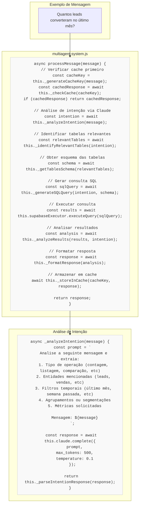

# Código em Ação: Exemplos Práticos

Este documento apresenta trechos específicos de código que demonstram como o sistema funciona na prática, destacando os processos-chave para o pitch de vendas.

## 🧠 Como o Sistema Interpreta Linguagem Natural



## 🔍 Como Transforma Perguntas em Consultas SQL

```mermaid
graph TD
    subgraph "Geração de SQL"
        code1["async _generateSQLQuery(intention, schema) {
  // Construir prompt com contexto rico
  const prompt = `
    Com base na intenção do usuário e no esquema do banco de dados,
    gere uma consulta SQL otimizada.
    
    Intenção: ${JSON.stringify(intention)}
    
    Esquema das tabelas:
    ${JSON.stringify(schema)}
    
    Regras:
    1. Use apenas as tabelas e colunas fornecidas no esquema
    2. Otimize a consulta para performance
    3. Inclua comentários explicando partes complexas
    4. Use aliases para melhorar legibilidade
    5. Aplique os filtros temporais corretamente
    
    Gere apenas o código SQL sem explicações adicionais.
  `;
  
  const response = await this.claude.complete({
    prompt,
    max_tokens: 1000,
    temperature: 0.2
  });
  
  return this._sanitizeSQL(response.trim());
}"]
    end
    
    subgraph "Exemplo de SQL Gerado"
        sql["-- Consulta para contar leads convertidos no último mês
SELECT 
  COUNT(DISTINCT l.id) AS total_leads_convertidos
FROM 
  leads l
  JOIN conversions c ON l.id = c.lead_id
WHERE 
  c.status = 'converted'
  AND c.conversion_date >= date_trunc('month', current_date - interval '1 month')
  AND c.conversion_date < date_trunc('month', current_date)"]
    end
    
    subgraph "Executor Supabase"
        code2["async executeQuery(sqlQuery) {
  try {
    // Validar query para segurança
    this._validateQuery(sqlQuery);
    
    // Aplicar otimizações específicas do PostgreSQL
    const optimizedQuery = this._optimizeForPostgres(sqlQuery);
    
    // Adicionar limites de segurança
    const safeLimitedQuery = this._addSafetyLimits(optimizedQuery);
    
    // Executar com timeout de segurança
    const { data, error } = await this.supabase.rpc(
      'execute_safe_query',
      { query_text: safeLimitedQuery },
      { timeout: 15000 }
    );
    
    if (error) throw new Error(`Query execution failed: ${error.message}`);
    
    // Processar resultados
    return this._processResults(data);
  } catch (error) {
    console.error('Query execution error:', error);
    throw error;
  }
}"]
    end
    
    code1 --> sql
    sql --> code2
    
    classDef codeBlock fill:#f9f9f9,stroke:#ccc,stroke-width:1px,color:#333,font-family:monospace;
    classDef sqlBlock fill:#f3f8ff,stroke:#88b,stroke-width:1px,color:#448,font-family:monospace;
    class code1,code2 codeBlock;
    class sql sqlBlock;
```



## 💬 Como Formata Respostas para WhatsApp

```mermaid
graph TD
    subgraph "Resultados da Consulta"
        results["{ total_leads_convertidos: 127 }"]
    end
    
    subgraph "Análise dos Resultados"
        code1["async _analyzeResults(results, intention) {
  // Extrair métricas principais
  const metrics = this._extractKeyMetrics(results);
  
  // Calcular métricas derivadas
  const derivedMetrics = this._calculateDerivedMetrics(metrics, intention);
  
  // Comparar com períodos anteriores se relevante
  const comparisons = await this._generateComparisons(metrics, intention);
  
  // Gerar insights baseados nos dados
  const insights = await this._generateInsights(
    metrics, 
    derivedMetrics,
    comparisons,
    intention
  );
  
  return {
    rawResults: results,
    metrics,
    derivedMetrics,
    comparisons,
    insights
  };
}"]
    end
    
    subgraph "Formatação para WhatsApp"
        code2["async formatResponse(analysis) {
  // Determinar o tipo de resposta
  const responseType = this._determineResponseType(analysis);
  
  // Selecionar template apropriado
  const template = this._selectTemplate(responseType);
  
  // Aplicar dados ao template
  let response = this._applyDataToTemplate(template, analysis);
  
  // Adicionar emojis contextuais
  response = this._addContextualEmojis(response, analysis);
  
  // Aplicar formatação Markdown para WhatsApp
  response = this._applyWhatsAppMarkdown(response);
  
  // Garantir limites de tamanho para mensagens
  response = this._ensureSizeConstraints(response);
  
  return response;
}"]
    end
    
    subgraph "Resposta Final Formatada"
        final["📊 *Resumo de Conversões*

✅ *127* leads convertidos no último mês

📈 Isso representa um *aumento de 23%* em relação ao mês anterior!

💡 *Insight:* Os leads que vieram do canal \"Instagram\" tiveram a maior taxa de conversão (34%)

🔍 _Para ver detalhes por canal, pergunte \"conversões por canal no último mês\"_"]
    end
    
    results --> code1
    code1 --> code2
    code2 --> final
    
    classDef codeBlock fill:#f9f9f9,stroke:#ccc,stroke-width:1px,color:#333,font-family:monospace;
    classDef dataBlock fill:#fff9f9,stroke:#caa,stroke-width:1px,color:#a44,font-family:monospace;
    classDef responseBlock fill:#f5fff5,stroke:#8a8,stroke-width:1px,color:#484,font-family:sans-serif;
    
    class code1,code2 codeBlock;
    class results dataBlock;
    class final responseBlock;
```

## 🔧 Aspectos Técnicos Avançados Implementados

### 1. Cache Multinível

```javascript
// Implementação de cache multinível em multiagent-system.js
async _checkCache(key) {
  // Verificar primeiro o cache em memória (mais rápido)
  const memoryCache = this.cacheManager.getFromMemory(key);
  if (memoryCache) {
    console.log('Cache HIT (memory):', key);
    return memoryCache;
  }
  
  // Se não encontrado, verificar cache persistente em arquivo
  const fileCache = await this.cacheManager.getFromFileCache(key);
  if (fileCache) {
    console.log('Cache HIT (file):', key);
    // Atualizar cache em memória para próxima consulta
    this.cacheManager.setInMemory(key, fileCache);
    return fileCache;
  }
  
  console.log('Cache MISS:', key);
  return null;
}

// Armazenamento com TTL dinâmico baseado em complexidade
async _storeInCache(key, value) {
  // Calcular TTL dinâmico baseado na complexidade da resposta
  const complexity = this._calculateResponseComplexity(value);
  const ttl = this._calculateDynamicTTL(complexity);
  
  // Armazenar em ambos os níveis de cache
  this.cacheManager.setInMemory(key, value, ttl / 2); // Cache em memória com TTL menor
  await this.cacheManager.setInFileCache(key, value, ttl); // Cache em arquivo com TTL completo
  
  console.log(`Cached with TTL ${ttl}s:`, key);
}
```

### 2. Processamento Contextual

```javascript
// Processamento contextual em multiagent-system.js
async _analyzeWithContext(message, userId) {
  // Recuperar histórico de conversa recente
  const conversationHistory = await this.historyManager.getRecentHistory(userId, 5);
  
  // Recuperar preferências e perfil do usuário
  const userProfile = await this.profileManager.getUserProfile(userId);
  
  // Recuperar contexto empresarial relevante
  const businessContext = await this.contextProvider.getRelevantBusinessContext();
  
  // Construir prompt enriquecido com contexto
  const enrichedPrompt = `
    Analise a seguinte mensagem considerando o contexto completo:
    
    Mensagem atual: "${message}"
    
    Histórico de conversa:
    ${this._formatConversationHistory(conversationHistory)}
    
    Perfil do usuário:
    ${JSON.stringify(userProfile)}
    
    Contexto empresarial:
    ${JSON.stringify(businessContext)}
    
    Forneça uma análise completa da intenção considerando todo o contexto.
  `;
  
  // Processar com Claude para entendimento contextual
  return await this.claude.complete({
    prompt: enrichedPrompt,
    max_tokens: 1000,
    temperature: 0.3
  });
}
```

### 3. Otimização de Consultas

```javascript
// Otimização de consultas em executor.js
_optimizeForPostgres(sqlQuery) {
  // Detectar padrões de consulta
  const queryPattern = this._detectQueryPattern(sqlQuery);
  
  // Aplicar otimizações específicas baseadas no padrão
  switch (queryPattern) {
    case 'aggregate_count':
      return this._optimizeAggregateCount(sqlQuery);
      
    case 'time_series':
      return this._optimizeTimeSeries(sqlQuery);
      
    case 'large_join':
      return this._optimizeLargeJoin(sqlQuery);
      
    case 'text_search':
      return this._optimizeTextSearch(sqlQuery);
      
    default:
      return this._applyGeneralOptimizations(sqlQuery);
  }
}

_optimizeAggregateCount(sqlQuery) {
  // Substituir COUNT(*) por COUNT(1) para performance
  let optimized = sqlQuery.replace(/COUNT\(\*\)/gi, 'COUNT(1)');
  
  // Adicionar índices de consulta específicos
  optimized = optimized.replace(
    /FROM\s+(\w+)/gi,
    (match, tableName) => `FROM ${tableName} INDEXED BY ${tableName}_count_idx`
  );
  
  // Adicionar dicas de planejador PostgreSQL
  if (optimized.includes('GROUP BY')) {
    optimized = optimized.replace(
      /SELECT/i,
      'SELECT /*+ HASHAGG */'
    );
  }
  
  return optimized;
}
```

### 4. Análise de Dados Inteligente

```javascript
// Análise de dados em multiagent-system.js
async _generateInsights(metrics, derivedMetrics, comparisons, intention) {
  // Detectar anomalias nos dados
  const anomalies = this._detectAnomalies(metrics, derivedMetrics);
  
  // Identificar tendências significativas
  const trends = this._identifyTrends(metrics, comparisons);
  
  // Correlacionar métricas para descobrir relações
  const correlations = this._findCorrelations(metrics, derivedMetrics);
  
  // Priorizar insights baseados na intenção original
  const prioritizedInsights = this._prioritizeInsightsByRelevance(
    anomalies,
    trends,
    correlations,
    intention
  );
  
  // Gerar descrições em linguagem natural dos insights
  const insightDescriptions = await this._generateInsightDescriptions(
    prioritizedInsights.slice(0, 3) // Limitar aos 3 insights mais relevantes
  );
  
  return insightDescriptions;
}

async _generateInsightDescriptions(insights) {
  const prompt = `
    Transforme os seguintes insights técnicos em descrições claras e acionáveis
    para um usuário de negócios. Use linguagem simples e direta.
    
    Insights técnicos:
    ${JSON.stringify(insights)}
    
    Para cada insight, forneça:
    1. Uma descrição clara do que foi observado
    2. O possível impacto para o negócio
    3. Uma sugestão de ação, se aplicável
  `;
  
  const response = await this.claude.complete({
    prompt,
    max_tokens: 800,
    temperature: 0.4
  });
  
  return this._parseInsightDescriptions(response);
}
```
