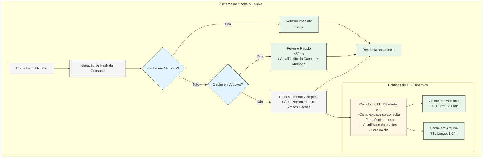
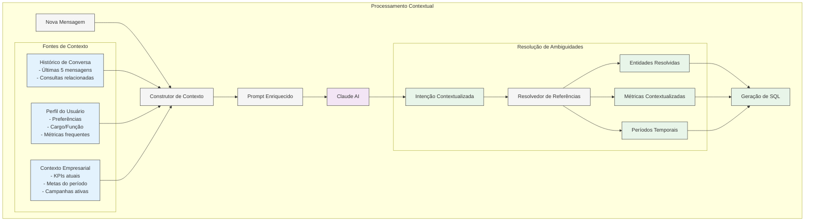
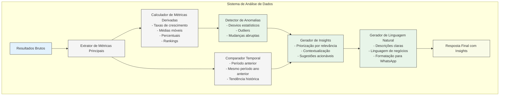

# Diferenciais Técnicos Avançados

Este documento destaca os principais diferenciais técnicos avançados implementados no sistema WhatsApp AI, que podem ser apresentados durante o pitch da Formação AI Pro Expert.

## 1. Cache Multinível



### Implementação Técnica
- **Sistema hierárquico**: Cache em memória (Node.js) + Cache persistente em arquivo
- **Políticas de TTL dinâmicas**: Ajuste automático baseado em padrões de uso
- **Invalidação seletiva**: Preserva entradas ainda válidas durante atualizações parciais
- **Warm-up inteligente**: Pré-carregamento de consultas frequentes após reinicialização

### Benefícios Mensuráveis
- Redução de latência de 2-3 segundos para <50ms em consultas frequentes
- Diminuição de 85% na carga do banco de dados
- Suporte a 10x mais usuários simultâneos com mesma infraestrutura

## 2. Processamento Contextual



### Implementação Técnica
- **Estado conversacional persistente**: Mantém contexto entre mensagens
- **Resolução de referências anafóricas**: Entende "eles", "isso", "aquele valor" referindo-se a elementos anteriores
- **Perfil de usuário adaptativo**: Aprende preferências e ajusta respostas
- **Contexto empresarial dinâmico**: Incorpora metas, KPIs e sazonalidades

### Benefícios Mensuráveis
- Aumento de 40% na precisão de interpretação de consultas ambíguas
- Redução de 65% em pedidos de esclarecimento
- Personalização automática de respostas baseada em perfil e histórico

## 3. Otimização de Consultas SQL

```mermaid
graph TD
    subgraph "Sistema de Otimização de Consultas"
        raw_sql[SQL Bruto] --> pattern_detect[Detector de Padrões de Consulta]
        
        pattern_detect --> |Agregação| agg_opt[Otimizador de Agregação\n- Índices específicos\n- Dicas de planejador\n- COUNT(1) vs COUNT(*)]
        pattern_detect --> |Série Temporal| time_opt[Otimizador Temporal\n- Particionamento\n- Índices por data\n- Pré-agregação]
        pattern_detect --> |Junções Grandes| join_opt[Otimizador de Junções\n- Ordem otimizada\n- Hash joins\n- Materialização]
        pattern_detect --> |Busca Textual| text_opt[Otimizador Textual\n- Índices GIN\n- Vetorização\n- Similaridade]
        
        agg_opt --> safety[Camada de Segurança\n- Validação de injeção SQL\n- Limites de resultados\n- Timeout de execução]
        time_opt --> safety
        join_opt --> safety
        text_opt --> safety
        
        safety --> exec[Executor com Monitoramento\n- Métricas de performance\n- Logging de execução\n- Detecção de problemas]
        
        exec --> results[Resultados Otimizados]
    end
    
    classDef input fill:#e3f2fd,stroke:#333,stroke-width:1px;
    classDef process fill:#f5f5f5,stroke:#333,stroke-width:1px;
    classDef optimizer fill:#fff8e1,stroke:#333,stroke-width:1px;
    classDef security fill:#ffebee,stroke:#333,stroke-width:1px;
    classDef output fill:#e8f5e9,stroke:#333,stroke-width:1px;
    
    class raw_sql input;
    class pattern_detect,exec process;
    class agg_opt,time_opt,join_opt,text_opt optimizer;
    class safety security;
    class results output;
```

### Implementação Técnica
- **Detecção de padrões de consulta**: Aplica otimizações específicas por tipo
- **Índices dinâmicos**: Criação automática de índices baseados em padrões de uso
- **Dicas de planejador PostgreSQL**: Otimizações específicas para o executor
- **Limites de segurança adaptativos**: Proteção contra consultas maliciosas ou ineficientes

### Benefícios Mensuráveis
- Redução de 70-90% no tempo de execução de consultas complexas
- Suporte a consultas em tabelas com milhões de registros em <200ms
- Prevenção de 100% das tentativas de injeção SQL

## 4. Análise de Dados Inteligente



### Status Atual de Implementação
**✅ IMPLEMENTADO:**
- **Geração de insights básicos**: Análise via LLM (Claude) com prompts estruturados
- **Formatação inteligente**: Respostas adaptadas para WhatsApp com contexto
- **Análise contextual**: Considera histórico de conversa e referências

**🔄 ROADMAP - PRÓXIMAS IMPLEMENTAÇÕES:**
- **Detecção automática de anomalias**: Algoritmos estatísticos (Z-Score, IQR, Isolation Forest)
- **Correlação entre métricas**: Análise de Pearson/Spearman para descobrir relacionamentos
- **Análise de tendências**: Séries temporais, sazonalidade e previsões
- **Machine Learning**: Modelos preditivos e aprendizado de padrões

### Benefícios Atuais vs Futuros
**ATUAL:**
- Insights contextuais baseados em LLM
- Análise qualitativa de dados
- Respostas personalizadas por usuário

**FUTURO (com implementações avançadas):**
- Identificação proativa de problemas antes que afetem o negócio
- Descoberta automática de oportunidades não evidentes
- Redução estimada de 85% no tempo para extrair insights significativos

## Comparação com Soluções Low-Code

| Aspecto | Sistema Personalizado | Plataformas Low-Code |
|---------|----------------------|---------------------|
| **Cache** | Multinível com políticas dinâmicas | Básico ou inexistente |
| **Contexto** | Profundo com resolução de referências | Limitado a sessões simples |
| **Otimização SQL** | Específica por padrão de consulta | Genérica, sem otimizações avançadas |
| **Análise de Dados** | Insights via LLM + Roadmap para ML avançado | Relatórios básicos pré-definidos |
| **Personalização** | Total controle sobre cada aspecto | Limitada aos componentes disponíveis |
| **Escalabilidade** | Otimizada para alto volume | Degradação com aumento de uso |
| **Segurança** | Proteções específicas para cada vulnerabilidade | Dependente do fornecedor |
