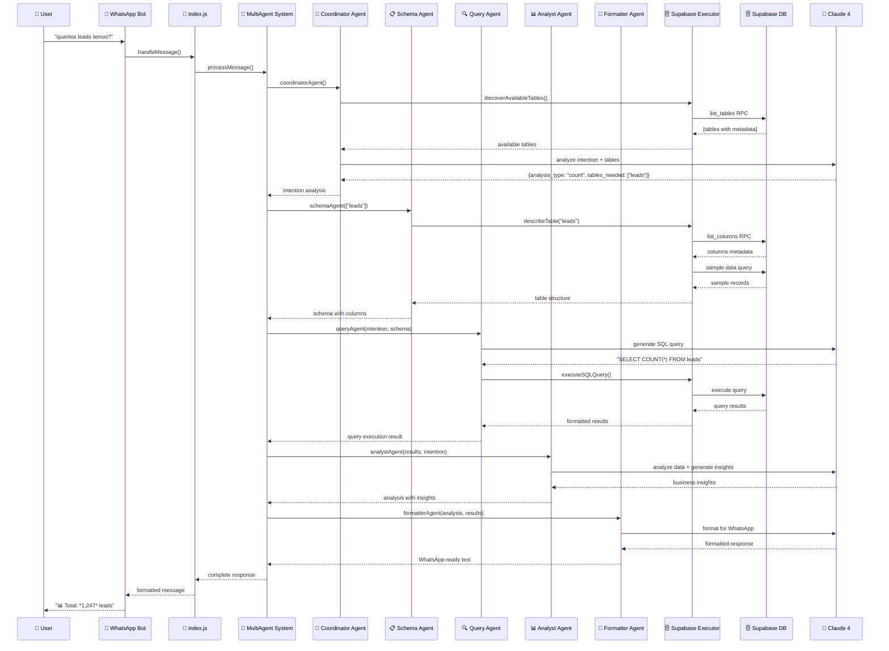
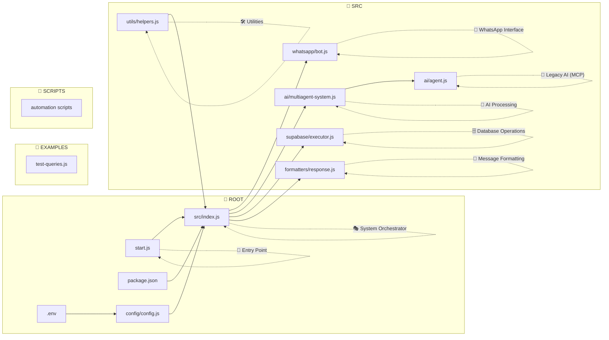
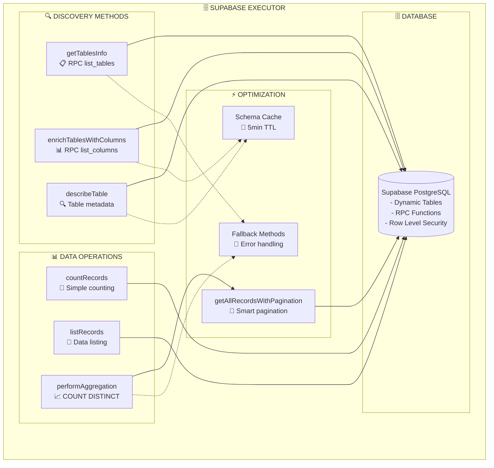
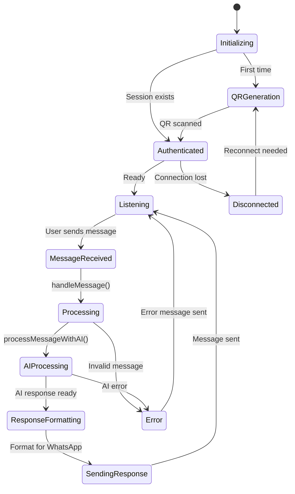
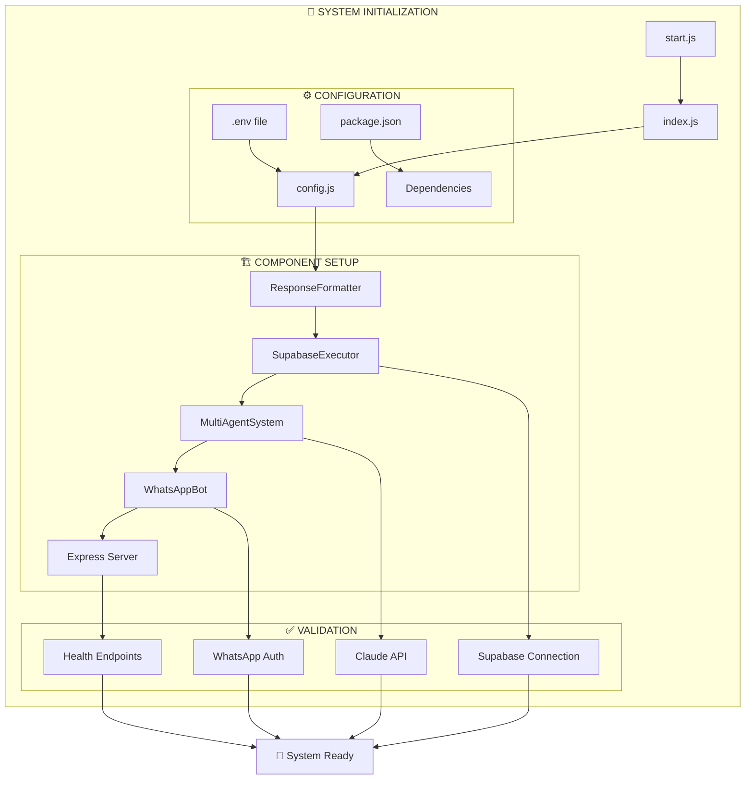
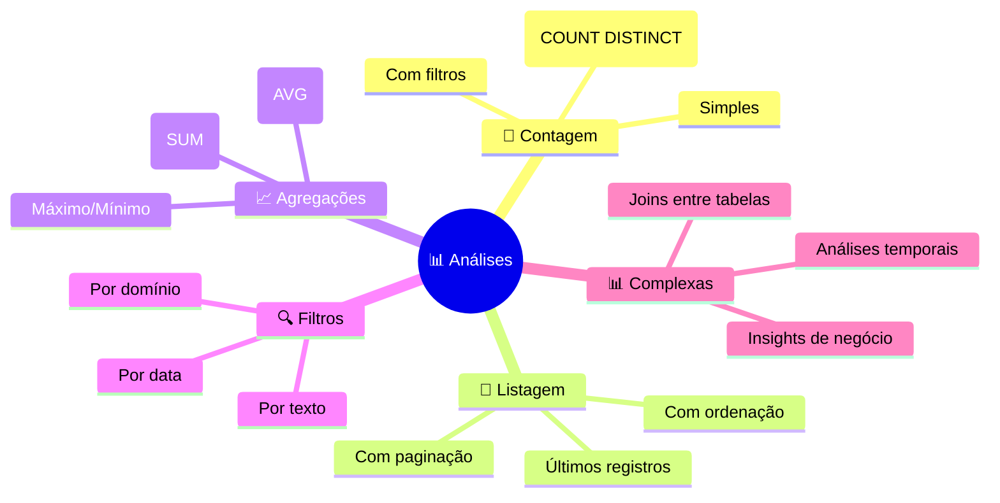

# 🏗️ Diagrama Mermaid - Sistema WhatsApp + IA + Supabase

## 📊 Arquitetura Geral do Sistema

```mermaid
graph TB
    %% === CAMADA DE INTERFACE ===
    subgraph "📱 INTERFACE LAYER"
        WA[WhatsApp User]
        QR[QR Code Scanner]
    end

    %% === CAMADA DE APLICAÇÃO ===
    subgraph "🤖 APPLICATION LAYER"
        subgraph "📂 /src"
            INDEX[index.js<br/>🚀 System Orchestrator]
            
            subgraph "📂 /whatsapp"
                BOT[bot.js<br/>📱 WhatsApp Bot<br/>- Message Handler<br/>- QR Generation<br/>- Session Management]
            end
            
            subgraph "📂 /ai"
                MAS[multiagent-system.js<br/>🧠 Multi-Agent System<br/>- Coordinator Agent<br/>- Schema Agent<br/>- Query Agent<br/>- Analyst Agent<br/>- Formatter Agent]
                AGENT[agent.js<br/>🤖 Legacy AI Agent<br/>(MCP-based)]
            end
            
            subgraph "📂 /supabase"
                EXEC[executor.js<br/>🗄️ Supabase Executor<br/>- Dynamic Discovery<br/>- Query Execution<br/>- Pagination Handler<br/>- Cache Manager]
            end
            
            subgraph "📂 /formatters"
                RESP[response.js<br/>💬 Response Formatter<br/>- WhatsApp Formatting<br/>- Emoji Addition<br/>- Text Structuring]
            end
            
            subgraph "📂 /utils"
                HELP[helpers.js<br/>🛠️ Helper Functions<br/>- Config Validation<br/>- Number Formatting<br/>- Input Sanitization]
            end
        end
        
        subgraph "📂 /config"
            CONFIG[config.js<br/>⚙️ System Configuration<br/>- API Keys<br/>- Database URLs<br/>- Model Settings]
        end
    end

    %% === CAMADA DE DADOS ===
    subgraph "🗄️ DATA LAYER"
        SUPA[Supabase Database<br/>📊 PostgreSQL<br/>- Dynamic Tables<br/>- RPC Functions<br/>- Row Level Security]
    end

    %% === CAMADA DE IA ===
    subgraph "🧠 AI LAYER"
        CLAUDE[Claude 4 API<br/>🤖 Anthropic<br/>- Natural Language<br/>- SQL Generation<br/>- Data Analysis<br/>- Response Formatting]
    end

    %% === CAMADA DE CONFIGURAÇÃO ===
    subgraph "⚙️ CONFIG LAYER"
        ENV[.env<br/>🔐 Environment Variables]
        PKG[package.json<br/>📦 Dependencies]
        START[start.js<br/>🚀 Entry Point]
    end

    %% === CONEXÕES PRINCIPAIS ===
    WA --> BOT
    QR --> BOT
    BOT --> INDEX
    INDEX --> MAS
    INDEX --> EXEC
    INDEX --> RESP
    INDEX --> CONFIG
    MAS --> CLAUDE
    MAS --> EXEC
    EXEC --> SUPA
    CONFIG --> ENV
    START --> INDEX
    HELP --> CONFIG

    %% === ESTILOS ===
    classDef interface fill:#e1f5fe
    classDef application fill:#f3e5f5
    classDef data fill:#e8f5e8
    classDef ai fill:#fff3e0
    classDef config fill:#fce4ec

    class WA,QR interface
    class INDEX,BOT,MAS,AGENT,EXEC,RESP,HELP,CONFIG application
    class SUPA data
    class CLAUDE ai
    class ENV,PKG,START config
```

## 🔄 Fluxo de Processamento Multi-Agentes



## 🗂️ Estrutura de Arquivos e Responsabilidades



## 🤖 Sistema Multi-Agentes Detalhado

```mermaid
graph TB
    subgraph "🧠 MULTI-AGENT SYSTEM"
        INPUT[📥 User Message<br/>"quantos leads únicos?"]
        
        subgraph "🎯 COORDINATOR AGENT"
            COORD_ANALYZE[Analyze Intention]
            COORD_DISCOVER[Discover Tables]
            COORD_PLAN[Plan Execution]
        end
        
        subgraph "📋 SCHEMA AGENT"
            SCHEMA_CACHE[Check Cache]
            SCHEMA_FETCH[Fetch Structure]
            SCHEMA_SAMPLE[Get Sample Data]
        end
        
        subgraph "🔍 QUERY AGENT"
            QUERY_BUILD[Build SQL]
            QUERY_OPTIMIZE[Optimize Query]
            QUERY_EXECUTE[Execute Query]
        end
        
        subgraph "📊 ANALYST AGENT"
            ANALYST_PROCESS[Process Results]
            ANALYST_INSIGHTS[Generate Insights]
            ANALYST_METRICS[Calculate Metrics]
        end
        
        subgraph "💬 FORMATTER AGENT"
            FORMAT_STRUCTURE[Structure Response]
            FORMAT_EMOJI[Add Emojis]
            FORMAT_WHATSAPP[WhatsApp Optimize]
        end
        
        OUTPUT[📤 Formatted Response<br/>"📊 *1,247* leads únicos"]
    end

    %% Fluxo sequencial
    INPUT --> COORD_ANALYZE
    COORD_ANALYZE --> COORD_DISCOVER
    COORD_DISCOVER --> COORD_PLAN
    COORD_PLAN --> SCHEMA_CACHE
    SCHEMA_CACHE --> SCHEMA_FETCH
    SCHEMA_FETCH --> SCHEMA_SAMPLE
    SCHEMA_SAMPLE --> QUERY_BUILD
    QUERY_BUILD --> QUERY_OPTIMIZE
    QUERY_OPTIMIZE --> QUERY_EXECUTE
    QUERY_EXECUTE --> ANALYST_PROCESS
    ANALYST_PROCESS --> ANALYST_INSIGHTS
    ANALYST_INSIGHTS --> ANALYST_METRICS
    ANALYST_METRICS --> FORMAT_STRUCTURE
    FORMAT_STRUCTURE --> FORMAT_EMOJI
    FORMAT_EMOJI --> FORMAT_WHATSAPP
    FORMAT_WHATSAPP --> OUTPUT

    %% Conexões com sistemas externos
    COORD_DISCOVER -.-> SUPABASE[(🗄️ Supabase)]
    SCHEMA_FETCH -.-> SUPABASE
    QUERY_EXECUTE -.-> SUPABASE
    
    COORD_ANALYZE -.-> CLAUDE[🤖 Claude 4]
    QUERY_BUILD -.-> CLAUDE
    ANALYST_INSIGHTS -.-> CLAUDE
    FORMAT_STRUCTURE -.-> CLAUDE
```

## 🗄️ Operações Supabase Executor



## 📱 WhatsApp Bot Flow



## 🔧 Configuração e Inicialização



## 📊 Tipos de Análises Suportadas



---

## 🎯 Pontos Críticos da Arquitetura

### ⚡ Performance
- **Cache de Schema**: 5 minutos TTL para metadados
- **Paginação Inteligente**: Resolve limite de 1000 registros
- **Descoberta Dinâmica**: Zero hardcode, adaptável a qualquer schema

### 🔒 Segurança
- **Row Level Security**: Políticas no Supabase
- **Service Role**: Acesso controlado via chaves
- **Sanitização**: Validação de inputs

### 🧠 Inteligência
- **Sistema Multi-Agentes**: 5 agentes especializados
- **Claude 4**: Processamento de linguagem natural
- **Análise Contextual**: Insights de negócio automáticos

### 📱 UX
- **Interface Natural**: Conversação via WhatsApp
- **Respostas Formatadas**: Emojis e estrutura otimizada
- **Feedback Imediato**: Status de "digitando..."