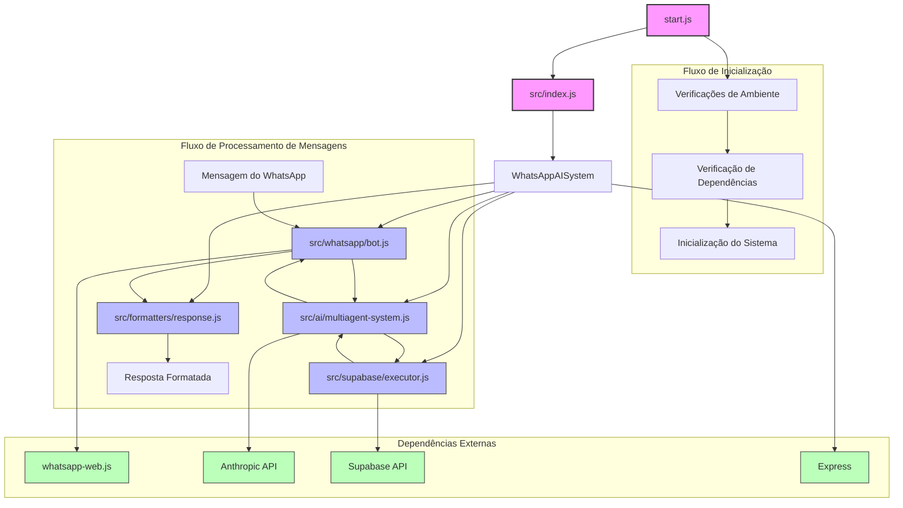

# Diagrama de Relações e Fluxo do Sistema Webinar-Matery-Agents



## Explicação do Fluxo de Execução

1. **Inicialização do Sistema**:
   - `start.js` é o ponto de entrada que verifica o ambiente, dependências e configurações
   - `start.js` carrega o arquivo `.env` e verifica variáveis obrigatórias
   - Após as verificações, `start.js` importa e executa `src/index.js`

2. **Estrutura Principal**:
   - `src/index.js` define a classe `WhatsAppAISystem` que orquestra todos os componentes
   - Inicializa os quatro componentes principais: WhatsAppBot, MultiAgentSystem, SupabaseExecutor e ResponseFormatter
   - Configura um servidor Express para monitoramento e status

3. **Componentes Principais**:
   - **WhatsAppBot** (`src/whatsapp/bot.js`): Gerencia a conexão com o WhatsApp usando whatsapp-web.js
   - **MultiAgentSystem** (`src/ai/multiagent-system.js`): Implementa o sistema de IA usando a API da Anthropic (Claude)
   - **SupabaseExecutor** (`src/supabase/executor.js`): Gerencia a conexão e consultas ao Supabase
   - **ResponseFormatter** (`src/formatters/response.js`): Formata as respostas para envio ao WhatsApp

4. **Fluxo de Processamento de Mensagens**:
   - Mensagem recebida pelo WhatsAppBot
   - WhatsAppBot encaminha para o MultiAgentSystem
   - MultiAgentSystem analisa a intenção e consulta o SupabaseExecutor quando necessário
   - Resposta é formatada pelo ResponseFormatter
   - WhatsAppBot envia a resposta formatada de volta ao usuário

5. **Dependências Externas**:
   - whatsapp-web.js para comunicação com WhatsApp
   - API da Anthropic (Claude) para processamento de linguagem natural
   - Supabase para armazenamento e consulta de dados
   - Express para servidor web de monitoramento
```
