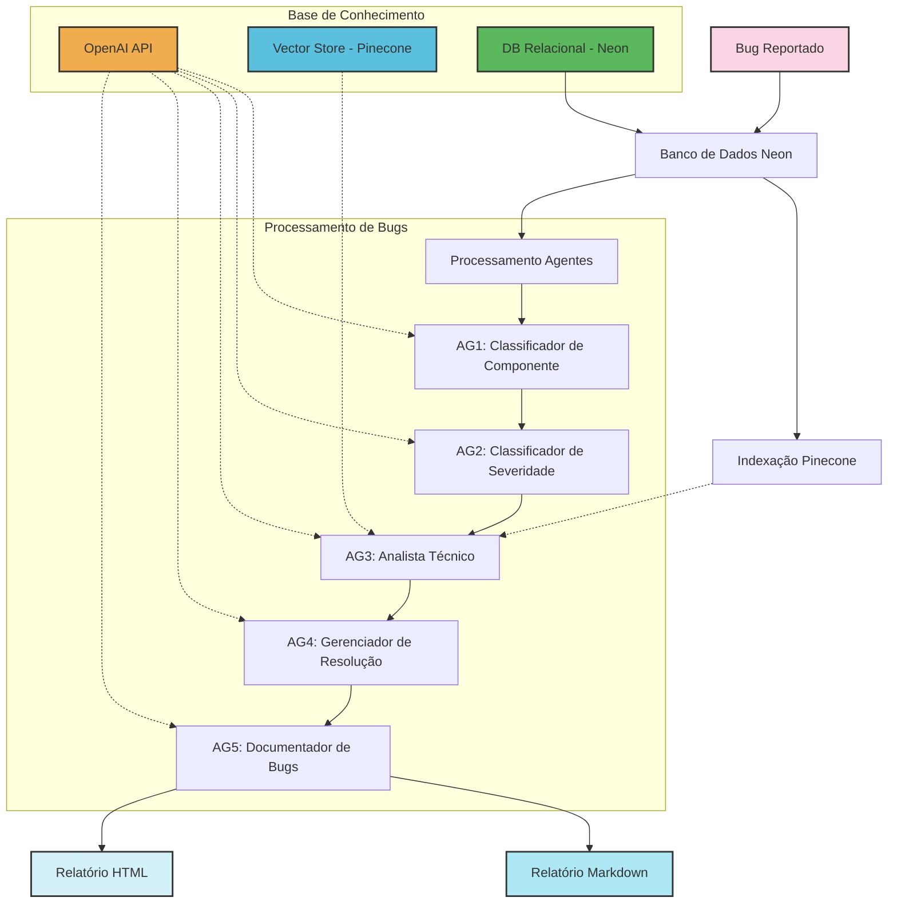

https://www.mermaidchart.com/app/projects/1711aea4-a22f-4159-802e-bc109a7e9938/diagrams/34f78ac0-500c-470a-b54c-57808990a352/version/v0.1/edit

## Explicação do Fluxo de Processamento de Bugs

1. **Bug Reportado**: Um novo bug é registrado no sistema ou reaberto para reprocessamento.

2. **Banco de Dados Neon**: Os dados do bug são armazenados no banco PostgreSQL da Neon, incluindo descrição, status e outras informações relevantes.

3. **Indexação Pinecone**: Paralelamente, o conteúdo textual do bug é convertido em embeddings e indexado no Pinecone para pesquisas semânticas e identificação de bugs similares.

4. **Processamento por Agentes Especializados**:
   - **AG1 (Classificador de Componente)**: Analisa o bug e determina qual componente do sistema está afetado (Frontend, Backend, Database, DevOps, Security, Integration, UI/UX, Infrastructure).
   - **AG2 (Classificador de Severidade)**: Determina a severidade do bug (Critico, Grave, Menor) com base no impacto técnico e de negócio.
   - **AG3 (Analista Técnico)**: Realiza análise técnica detalhada, identifica causa raiz e propõe soluções, podendo consultar a base vetorial no Pinecone para encontrar bugs similares.
   - **AG4 (Gerenciador de Resolução)**: Coordena o processo de resolução, define responsáveis, prazos e prioridades.
   - **AG5 (Documentador de Bugs)**: Compila todas as informações e gera documentação estruturada em múltiplos formatos.

5. **Relatórios Gerados**: 
   - **Relatório Markdown**: Documento com a análise completa e recomendações em formato Markdown, salvo como arquivo local (`bug_X_relatorio.md`).
   - **Relatório HTML**: Versão interativa do relatório com diagrama Mermaid, salvo como arquivo local (`bug_X_relatorio.html`).

O diagrama também mostra as interações com:
- **OpenAI API**: Fornece os modelos de IA para todos os agentes.
- **Vector Store (Pinecone)**: Armazena embeddings para consulta semântica e identificação de bugs similares.
- **DB Relacional (Neon)**: Armazena todos os dados estruturados dos bugs e suas classificações.

## Persistência Redundante

Uma característica importante do sistema é a persistência redundante:

1. **Banco de Dados**: Todas as informações são armazenadas nas tabelas do banco de dados Neon.
2. **Arquivos Locais**: Os relatórios são também salvos como arquivos locais, garantindo que mesmo em caso de falha no banco de dados, os resultados não sejam perdidos.

Esta abordagem garante maior robustez ao sistema, permitindo que ele continue funcionando mesmo em cenários de falha parcial.
