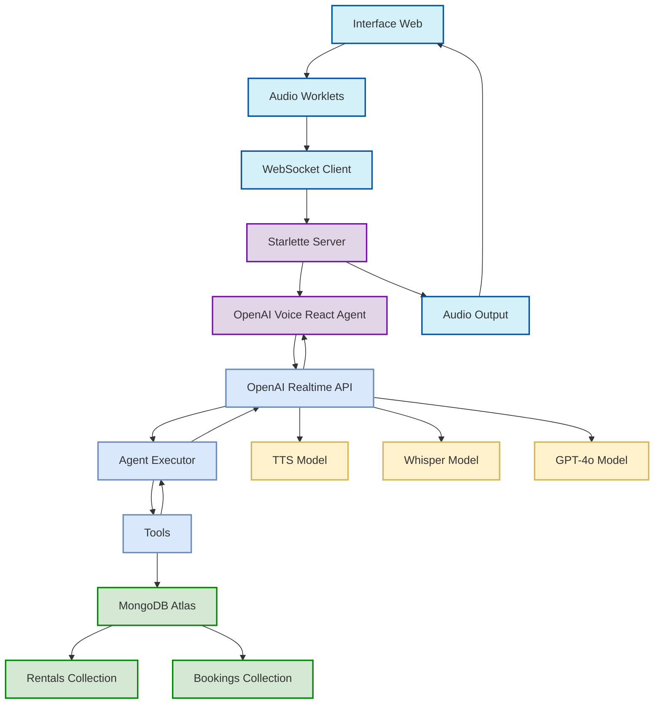

# Arquitetura do Voice Agent com MongoDB Atlas Vector Search

https://www.mermaidchart.com/app/projects/1711aea4-a22f-4159-802e-bc109a7e9938/diagrams/0288e3ef-f8a4-44b4-89ac-397f0684db3d/version/v0.1/edit

Este diagrama representa a arquitetura e o fluxo de dados do agente de voz para consulta de propriedades de aluguel usando MongoDB Atlas Vector Search e OpenAI Realtime API.

## Fluxo de Dados

1. O usuário interage com a interface web e clica no botão "Start Audio"
2. Os Audio Worklets capturam o áudio do microfone do usuário
3. O áudio é transmitido em tempo real via WebSocket para o servidor
4. O OpenAI Voice React Agent recebe o áudio e o envia para a API Realtime da OpenAI
5. A API da OpenAI transcreve o áudio em texto usando o modelo Whisper
6. O texto é processado pelo Agent Executor que decide quais ferramentas usar
7. As ferramentas fazem consultas ao MongoDB Atlas
8. O MongoDB Atlas retorna resultados usando pesquisa vetorial
9. Os resultados são retornados para o Agent Executor
10. O Agent Executor gera uma resposta baseada nos resultados
11. A resposta é sintetizada em áudio pela API da OpenAI
12. O áudio é transmitido de volta para o navegador e reproduzido para o usuário

## Componentes Principais

### Frontend
- **Interface Web**: Interface HTML/JS simples com botão para iniciar captura de áudio
- **Audio Worklets**: Processadores de áudio JavaScript para captura e reprodução
- **WebSocket Client**: Gerencia a comunicação em tempo real com o servidor

### Backend
- **Starlette Server**: Servidor web assíncrono que gerencia conexões WebSocket
- **OpenAI Voice React Agent**: Componente LangChain que orquestra o fluxo de voz
- **Tools**: Ferramentas personalizadas para consulta e manipulação de dados

### Serviços OpenAI
- **Whisper Model**: Converte áudio em texto (Speech-to-Text)
- **GPT-4o Model**: Processa texto e gera respostas inteligentes
- **TTS Model**: Converte texto em áudio (Text-to-Speech)

### MongoDB Atlas
- **Vector Search**: Pesquisa semântica usando embeddings de texto
- **Rentals Collection**: Armazena dados de propriedades para aluguel
- **Bookings Collection**: Armazena reservas feitas pelos usuários