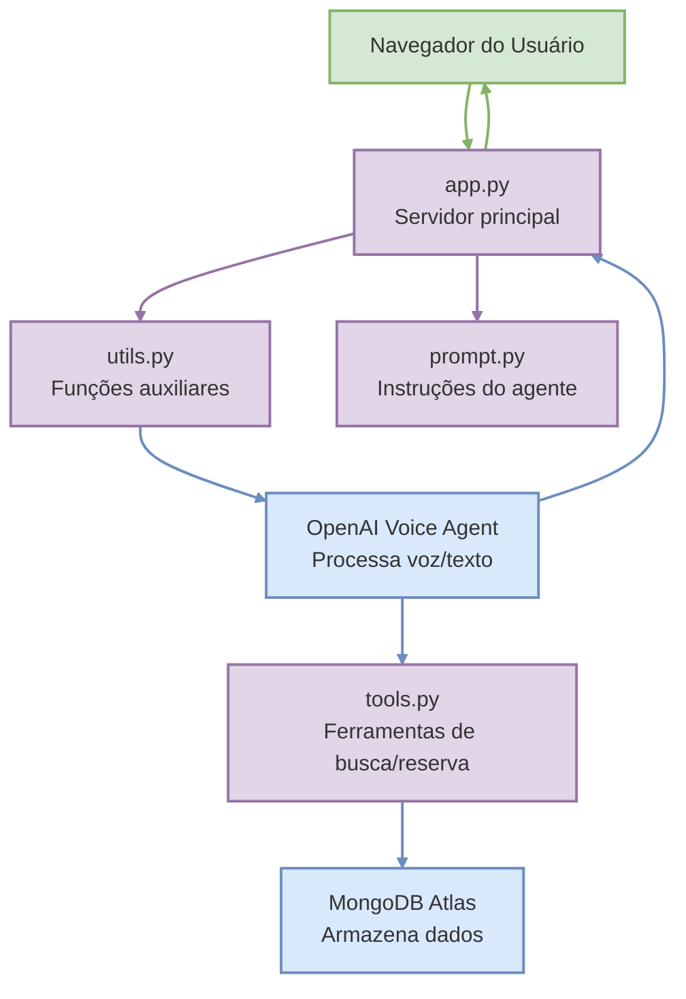

# Diagrama Simplificado do Voice Agents
https://www.mermaidchart.com/app/projects/1711aea4-a22f-4159-802e-bc109a7e9938/diagrams/af93f13f-b370-438a-a170-6e591a4fbebf/version/v0.1/edit

Este diagrama mostra de forma simplificada como os principais arquivos Python do projeto Voice Agents se relacionam.

## Explicação Simples

### Fluxo de Funcionamento

1. **Navegador** → envia áudio do usuário via WebSocket

2. **app.py** → recebe a conexão e coordena todo o processo

3. **utils.py** → transforma os dados do WebSocket em um fluxo contínuo

4. **prompt.py** → fornece instruções sobre como o agente deve se comportar

5. **OpenAI Voice Agent** → processa o áudio, entende a intenção do usuário

6. **tools.py** → fornece ferramentas para buscar acomodações ou fazer reservas

7. **MongoDB Atlas** → armazena dados sobre acomodações e reservas

8. **Resposta** → volta pelo mesmo caminho até o navegador do usuário

### Função de Cada Arquivo

- **app.py**: Coordenador central, configura o servidor e as rotas
- **utils.py**: Ferramentas auxiliares para processamento de dados
- **prompt.py**: "Personalidade" e instruções do assistente virtual
- **tools.py**: Ferramentas que permitem o agente realizar ações concretas

Esta arquitetura permite que o usuário tenha uma conversa natural por voz para buscar e reservar acomodações.
