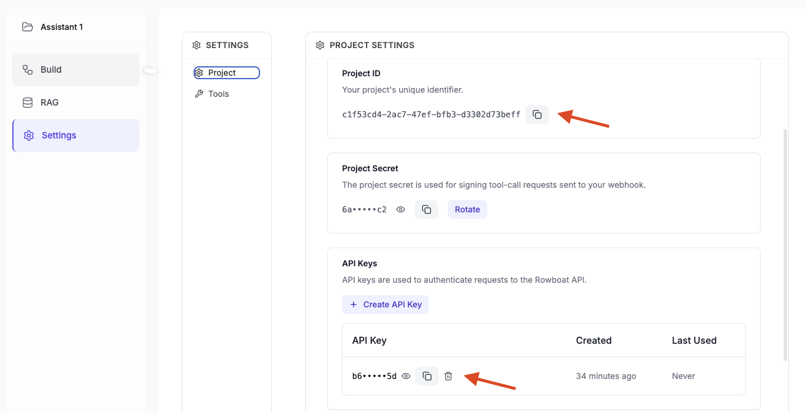

# Using the API

This is a guide on using the HTTP API to power conversations with the assistant created in Studio.

## Deploy your assistant to production on Studio


## Obtain API key and Project ID

Generate API keys via the developer configs in your project. Copy the Project ID from the same page.


## API Endpoint

```
POST <HOST>/api/v1/<PROJECT_ID>/chat
```

Where:

- For self-hosted: `<HOST>` is `http://localhost:3000`

## Authentication

Include your API key in the Authorization header:

```
Authorization: Bearer <API_KEY>
```

## Examples

### First Turn

```bash
curl --location '<HOST>/api/v1/<PROJECT_ID>/chat' \
--header 'Content-Type: application/json' \
--header 'Authorization: Bearer <API_KEY>' \
--data '{
    "messages": [
        {
            "role": "user",
            "content": "Hello, can you help me?"
        }
    ],
    "state": null
}'
```

Response:
```json
{
    "messages": [
        {
            "role": "assistant",
            "content": "Hello! Yes, I'd be happy to help you. What can I assist you with today?",
            "agenticResponseType": "external"
        }
    ],
    "state": {
        "last_agent_name": "MainAgent"
    }
}
```

### Subsequent Turn

Notice how we include both the previous messages and the state from the last response:

```bash
curl --location '<HOST>/api/v1/<PROJECT_ID>/chat' \
--header 'Content-Type: application/json' \
--header 'Authorization: Bearer <API_KEY>' \
--data '{
    "messages": [
        {
            "role": "user",
            "content": "Hello, can you help me?"
        },
        {
            "role": "assistant",
            "content": "Hello! Yes, I'd be happy to help you. What can I assist you with today?",
            "agenticResponseType": "external"
        },
        {
            "role": "user",
            "content": "What services do you offer?"
        }
    ],
    "state": {
        "last_agent_name": "MainAgent"
    }
}'
```

## API Specification

### Request Schema

```typescript
{
    // Required fields
    messages: Message[];      // Array of message objects representing the conversation history
    state: any;              // State object from previous response, or null for first message

    // Optional fields
    workflowId?: string;     // Specific workflow ID to use (defaults to production workflow)
    testProfileId?: string;  // Test profile ID for simulation
}
```

### Message Types

Messages can be one of the following types:

1. System Message
```typescript
{
    role: "system";
    content: string;
}
```

2. User Message
```typescript
{
    role: "user";
    content: string;
}
```

3. Assistant Message
```typescript
{
    role: "assistant";
    content: string;
    agenticResponseType: "internal" | "external";
    agenticSender?: string | null;
}
```

### Response Schema

```typescript
{
    messages: Message[];  // Array of new messages from this turn
    state: any;          // State object to pass in the next request
}
```

## Important Notes

1. Always pass the complete conversation history in the `messages` array
2. Always include the `state` from the previous response in your next request
3. The last message in the response's `messages` array will be a user-facing assistant message (`agenticResponseType: "external"`)

## Rate Limiting

The API has rate limits per project. If exceeded, you'll receive a 429 status code.

## Error Responses

- 400: Invalid request body or missing/invalid Authorization header
- 403: Invalid API key
- 404: Project or workflow not found
- 429: Rate limit exceeded